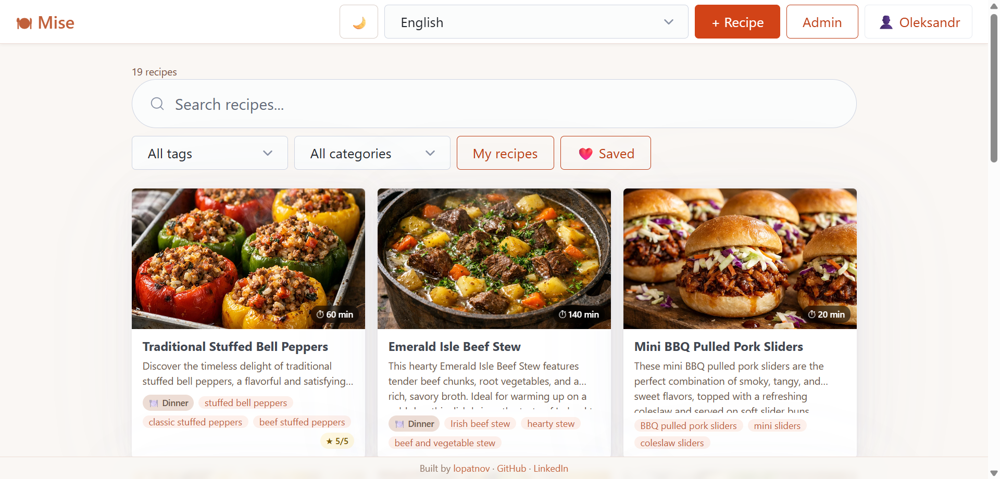
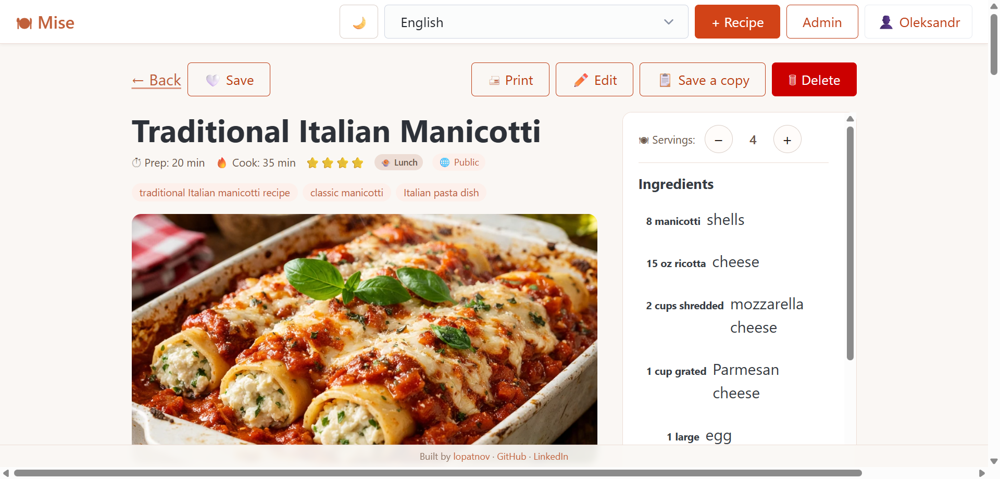
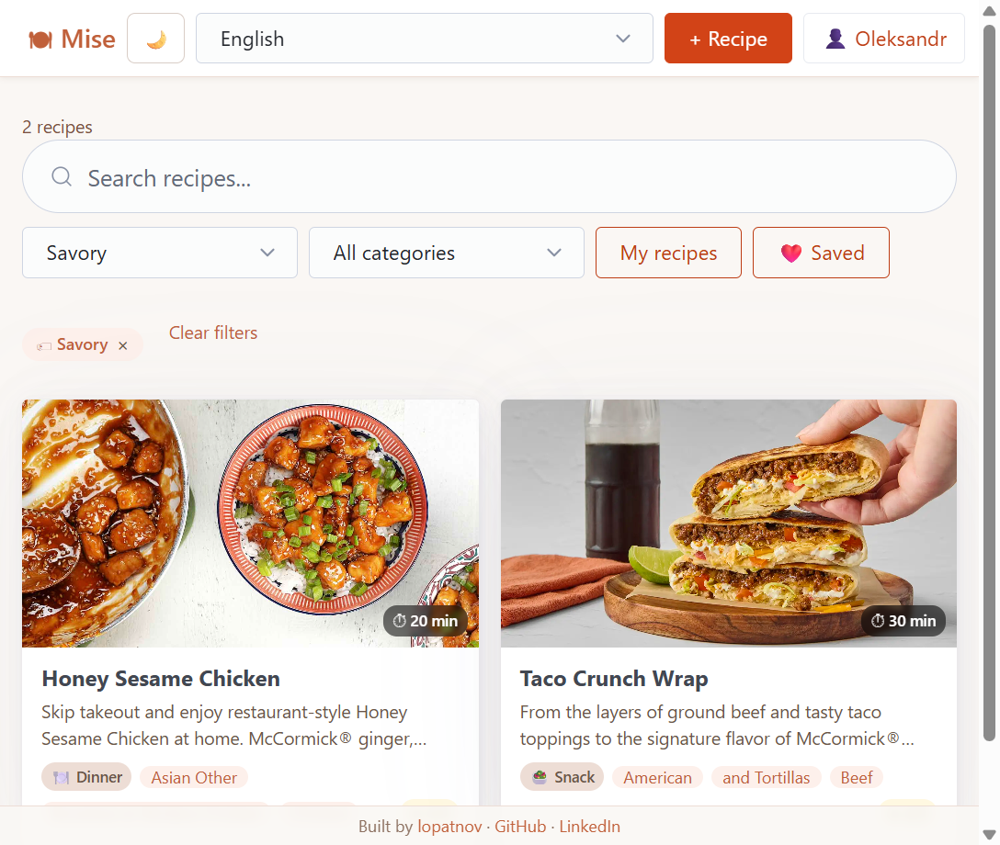
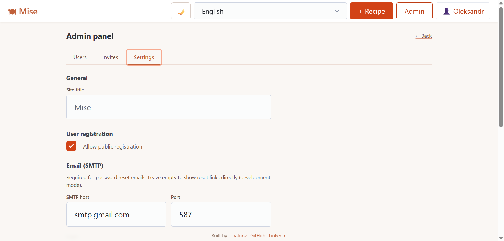

# 🍽 Mise

> _mise en place_ — everything in its place

Open-source recipe manager you can self-host and fully own.
Store and share recipes with photos, ingredients, and step-by-step instructions.
Scale servings, search by text, filter by tag and category, import from any recipe URL.

[](https://github.com/lopatnov/mise/actions/workflows/ci.yml)
[](LICENSE)
[](https://github.com/lopatnov/mise/issues)
[](https://github.com/lopatnov/mise/stargazers)

## Screenshots

**Recipe feed** — browse, search by text, filter by tag and category, paginate



**Recipe detail** — ingredients sidebar, servings scaler, step-by-step instructions with photos



**Tag filtering** — active filter chip with one-click clear



**Admin panel** — manage users, roles, invite links, SMTP and app settings



## Stack

| Layer          | Technology                                 |
| -------------- | ------------------------------------------ |
| Backend        | Node.js 24, NestJS 11, TypeScript          |
| Database       | MongoDB 8, Mongoose                        |
| Auth           | JWT Bearer, bcrypt                         |
| Frontend       | React 19, Vite 8, React Query 5, Zustand 5 |
| i18n           | react-i18next · 33 languages               |
| Reverse proxy  | nginx (single-port, CSP headers)           |
| Infrastructure | Docker Compose                             |

## Features

- **Recipe management** — create, edit, delete with full details
- **Ingredients & steps** — dynamic lists with per-step photos
- **Photo upload** — main photo + photo per step, lightbox viewer
- **Categories** — pre-seeded (breakfast, lunch, dinner, dessert…)
- **Tags** — tag filter with autocomplete from existing tags
- **Search** — partial text search across title, description, and tags
- **Servings scaler** — ingredient amounts scale automatically
- **Sharing** — mark recipes as public, visible to anyone
- **Favorites** — save recipes from the community feed to a personal bookmarks list
- **Import from URL** — paste any recipe page URL, structured data (JSON-LD / Open Graph) is extracted automatically
- **Duplicate** — save a copy of any recipe as a starting point
- **Drag-and-drop reorder** — reorder ingredients and steps by dragging
- **Dark / light theme** — toggle in the navbar, respects system preference
- **Print view** — clean print layout via CSS `@media print`
- **Admin panel** — user management, invite links, SMTP, password reset
- **33 languages** — EN, UK, RU, BG, CS, DA, DE, EL, ES, FI, FR, HI, HR, HU, ID, IT, JA, KO, LT, LV, NL, NO, PL, PT, PT-BR, RO, SK, SV, TH, TR, VI, ZH, ZH-TW

---

## Running locally (development)

> **Run in this order:** MongoDB first → API → Frontend.

### Prerequisites

| Tool           | Version | Download                                       |
| -------------- | ------- | ---------------------------------------------- |
| Git            | any     | https://git-scm.com                            |
| Node.js        | 24+     | https://nodejs.org (LTS)                       |
| Docker Desktop | any     | https://www.docker.com/products/docker-desktop |

### Step 1 — Clone

```bash
git clone https://github.com/lopatnov/mise.git
cd mise
```

### Step 2 — Start MongoDB

```bash
docker compose up -d
```

MongoDB runs on `localhost:27017`. Data is stored in the Docker-managed volume
`mise_mongo_data` and **survives `docker compose down`** — only `docker compose down -v`
wipes it. You will never need to restart MongoDB unless you explicitly stop it.

### Step 3 — Start the API

```bash
cd api
npm install        # first time only
npm run start:dev  # watch mode — restarts on file changes
```

- API: http://localhost:3000/api
- Swagger: http://localhost:3000/api/docs

### Step 4 — Start the frontend

```bash
cd web
npm install        # first time only
npm run dev        # Vite HMR — updates instantly on save
```

- App: http://localhost:4200

Open the app, go to `/setup` to create the first admin account, then register users.

---

## Configuration files

| File | Committed | Purpose |
| ------------ | --------- | ----------------------------------------------------------------------- |
| `api/.env` | ✅ | NestJS dev config — MongoDB localhost, placeholder secret |
| `web/.env` | ✅ | Vite dev config — API URL for local development |
| `.env.prod` | ✅ | Production secrets — **edit `APP_URL` and `JWT_SECRET` before deploying** |

`api/.env` and `web/.env` are used in development only.
`.env.prod` is used only when running with `docker-compose.prod.yml`.

---

## Deploying

### Requirements

- Linux server with Docker and Docker Compose
- One open port (default **80**, configurable in `docker-compose.prod.yml`)

### Step 1 — Clone

```bash
git clone https://github.com/lopatnov/mise.git
cd mise
```

### Step 2 — Configure

Open `.env.prod` and set:
- `APP_URL` — your server's URL (used in password-reset emails)
- `JWT_SECRET` — long random string (`openssl rand -hex 32`)

If port 80 is taken, change `80:80` in `docker-compose.prod.yml` to your port (e.g. `8080:80`).

### Step 3 — Start

```bash
docker compose -f docker-compose.prod.yml up -d --build
```

- App: `http://YOUR_SERVER_IP` (or the port you configured)
- Swagger: `http://YOUR_SERVER_IP/api/docs`

All traffic goes through a single nginx port — the API container is internal only.

Go to `/setup` to create the admin account on first run.

### Updating to a new release

```bash
git pull
docker compose -f docker-compose.prod.yml up -d --build
```

### Stopping

```bash
# Stop containers (data is preserved)
docker compose -f docker-compose.prod.yml down

# Stop and wipe ALL data including database
docker compose -f docker-compose.prod.yml down -v
```

### Data and backups

| Data            | Location                        | Notes                              |
| --------------- | ------------------------------- | ---------------------------------- |
| MongoDB         | Docker volume `mise_mongo_data` | Managed by Docker, survives `down` |
| Uploaded photos | `./data/uploads/` on the host   | Plain files, easy to copy          |

**Back up MongoDB:**

```bash
docker run --rm \
  -v mise_mongo_data:/data/db \
  -v $(pwd)/backup:/backup \
  mongo:8 mongodump --out /backup
```

**Restore MongoDB:**

```bash
docker run --rm \
  -v mise_mongo_data:/data/db \
  -v $(pwd)/backup:/backup \
  mongo:8 mongorestore /backup
```

**Back up uploads:**

```bash
cp -r ./data/uploads /your/backup/location/
```

---

## Making a GitHub Release

```bash
# Tag the commit you want to release
git tag v1.0.0
git push origin v1.0.0
```

Then create a release on GitHub and attach nothing — users just clone the tag:

```bash
git clone --branch v1.0.0 https://github.com/lopatnov/mise.git
```

They then follow the Production deployment steps above.

---

## Analytics & Tracking

Add any analytics script to `web/index.html` inside the `<head>` tag, before `</head>`.

```html
<!-- Google Analytics example -->
<script async src="https://www.googletagmanager.com/gtag/js?id=G-XXXXXXXXXX"></script>
<script>
  window.dataLayer = window.dataLayer || [];
  function gtag(){dataLayer.push(arguments);}
  gtag('js', new Date());
  gtag('config', 'G-XXXXXXXXXX');
</script>

<!-- Privacy-friendly alternatives: Plausible, Umami, Matomo (self-hosted) -->
```

The script is embedded in the static HTML and fires on every SPA page. Rebuild the Docker image after editing (`docker compose -f docker-compose.prod.yml up -d --build`).

---

## API

Swagger UI: http://localhost:3000/api/docs (dev) · http://YOUR_SERVER_IP/api/docs (prod)

All endpoints are prefixed with `/api`:

```
POST /api/auth/register          Register (checks allowRegistration + inviteToken)
POST /api/auth/login             Login → JWT
GET  /api/auth/me                Current user
POST /api/auth/forgot-password   Request password reset link
POST /api/auth/reset-password    Set new password via token

GET    /api/admin/setup          Check if admin exists (public)
POST   /api/admin/setup          Create first admin (public)
GET    /api/admin/settings       App settings
PATCH  /api/admin/settings       Update settings (admin only)
GET    /api/admin/users          List users (admin only)
PATCH  /api/admin/users/:id      Update role/status (admin only)
DELETE /api/admin/users/:id      Delete user (admin only)
POST   /api/admin/invites        Create invite link (admin only)
GET    /api/admin/invites        List active invites (admin only)
DELETE /api/admin/invites/:id    Revoke invite (admin only)

GET    /api/recipes              List recipes (q, tag, category, mine, page, limit)
POST   /api/recipes              Create recipe
GET    /api/recipes/:id          Get recipe (public if isPublic=true)
PATCH  /api/recipes/:id          Update recipe
DELETE /api/recipes/:id          Delete recipe
POST   /api/recipes/:id/photo    Upload main photo
POST   /api/recipes/:id/steps/:order/photo  Upload step photo
POST   /api/recipes/import-url   Import recipe data from URL (JSON-LD / Open Graph)
GET    /api/recipes/public       Public recipes (no auth)
GET    /api/recipes/tags         All distinct tags (no auth)
POST   /api/recipes/:id/saved    Save recipe to favorites
DELETE /api/recipes/:id/saved    Remove recipe from favorites

GET  /api/categories             List categories
```

---

## Troubleshooting

| Symptom                           | Cause                                        | Fix                                                                                                                         |
| --------------------------------- | -------------------------------------------- | --------------------------------------------------------------------------------------------------------------------------- |
| `Cannot connect to Docker daemon` | Docker Desktop not running                   | Open Docker Desktop and wait for the whale icon                                                                             |
| API exits immediately             | Missing `api/.env`                           | Create the file as shown in Step 2                                                                                          |
| `MongoNetworkError`               | MongoDB not started                          | `docker compose up -d` from repo root                                                                                       |
| Frontend network errors           | Wrong `VITE_API_URL`                         | Check `web/.env`                                                                                                            |
| 500 on login                      | User created before `isActive` field existed | `docker exec -it mise-mongodb mongosh mise --eval 'db.users.updateMany({isActive:{$exists:false}},{$set:{isActive:true}})'` |
| Images not loading in Docker      | Old named volume for uploads                 | The volume should be a bind mount — see `docker-compose.prod.yml`                                                           |

---

## Contributing

Contributions are welcome! Please read [CONTRIBUTING.md](CONTRIBUTING.md) before opening a pull request.

- Bug reports → [open an issue](https://github.com/lopatnov/mise/issues)
- Security vulnerabilities → [GitHub Security Advisories](https://github.com/lopatnov/mise/security/advisories/new) _(do not use public issues)_
- Questions → [Discussions](https://github.com/lopatnov/mise/discussions)
- Found it useful? A [star on GitHub](https://github.com/lopatnov/mise) helps others discover the project

---

## License

[GNU General Public License v3.0](LICENSE) © 2025–2026 [Oleksandr Lopatnov](https://github.com/lopatnov) · [LinkedIn](https://www.linkedin.com/in/lopatnov/)
